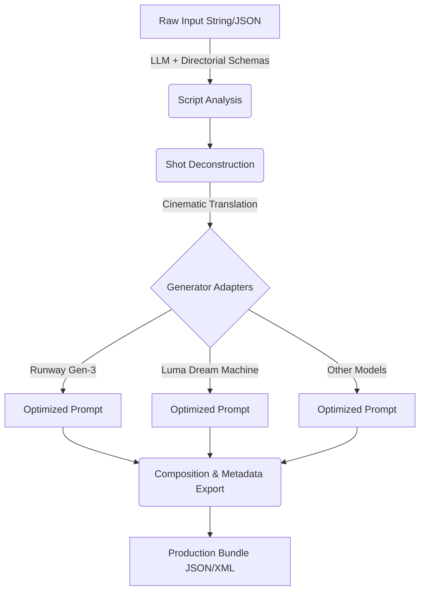

# `martin` System Design Document

## 1. Introduction
**`martin`** is an LLM-driven media director implemented as a framework-agnostic NPM package. It acts as an orchestration layer between human creative intent and AI video generation tools. It translates high-level prompts into a structured **Shot Production Manifest (SPM)**, providing precise, cinematic technical descriptions for downstream video generation models.

## 2. Architecture Overview
The system follows a pipeline-based architecture composed of four distinct phases:

1. **Script Analysis (LLM Interface)**
2. **Shot Deconstruction**
3. **Generator Translation Layer (Adapters)**
4. **Composition & Metadata Export**



## 3. Core Modules

### 3.1 LLM Interface & Schema Engine
- **Responsibility:** Parses raw text or JSON input into a cinematic structure.
- **Mechanism:** Leverages custom "Directorial Schemas" to enforce structured JSON output from the LLM. It extracts mood, color palette, and character consistency markers.
- **Extensibility:** Agnostic to the underlying LLM (supports OpenAI, Anthropic, Llama 3, etc.).

### 3.2 Shot Deconstruction Engine
- **Responsibility:** Breaks down the narrative into a sequence of individual shots.
- **Mechanism:** Assigns specific, real-world filmmaking attributes to each shot using built-in dictionaries:
  - **Camera Movement:** e.g., Slow Push-in, Tracking, Low-Angle Tilt.
  - **Technical Lighting:** e.g., Rembrandt lighting, 4800K, High Contrast.
  - **Lens Choice:** e.g., 35mm anamorphic.

### 3.3 Generator Translation Layer (Adapters)
- **Responsibility:** Translates the abstract Shot Production Manifest into vendor-specific prompts.
- **Mechanism:** Uses an adapter pattern. Different AI video generators have unique prompt weighting and syntax requirements.
  - *Runway Adapter:* Injects keywords for high-fidelity motion.
  - *Luma Adapter:* Focuses on spatial consistency and fluid movement.

### 3.4 Export & Composition Engine
- **Responsibility:** Packages the final output into a usable format for creators.
- **Output (Production Bundle):**
  - Text prompts optimized for the chosen video generator.
  - (Optional) ControlNet Maps for tools like Stable Video Diffusion.
  - Compositing Notes in `.json` or `.xml` format, ready for NLEs (Premiere, DaVinci Resolve) to structure timelines.

## 4. Data Models

### 4.1 Production Manifest (SPM)
The core data structure representing an entire generation request.
```typescript
interface ProductionManifest {
  id: string;
  mood: string;
  colorPalette: string[];
  characterMarkers: Record<string, string>;
  shots: Shot[];
}
```

### 4.2 Shot Model
```typescript
interface Shot {
  id: string;
  sequenceNumber: number;
  description: string;
  camera: {
    movement: string;
    angle: string;
  };
  lighting: string;
  lens: string;
  durationEstimate?: string;
}
```

## 5. API Design

The primary entry point is the `Martin` class.

```typescript
import { Martin } from 'martin-director';

// 1. Initialization
const director = new Martin({
  llm: 'gpt-4o',             // Pluggable LLM
  style: 'noir-cinematic',   // Global style preset
  aspectRatio: '21:9'        // Global output constraint
});

// 2. Planning (Pipeline execution)
const production = await director.plan(`
  A high-speed chase through a glass-walled library. 
  The protagonist is a digital ghost.
`);

// 3. Export
const lumaPrompts = production.export('luma');
const runwayPrompts = production.export('runway-gen3');
```

## 6. Extensibility and Future-proofing
- **Modular LLM Providers:** Simple interfaces to swap LLM backends without altering creative logic.
- **Adapter Registry:** Developers can register custom adapters for new video generation models as they emerge.
- **Cinematic Dictionary:** Extensible configurations for camera movements, lenses, and lighting setups to ensure accurate prompt generation.
